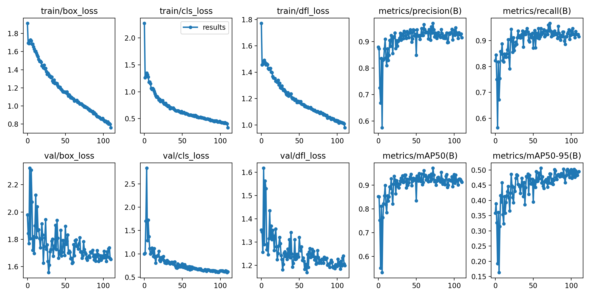
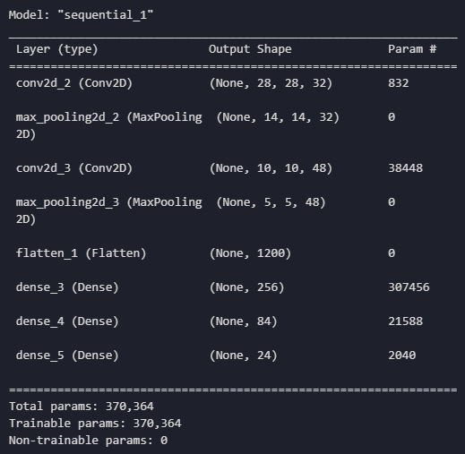
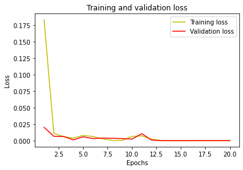
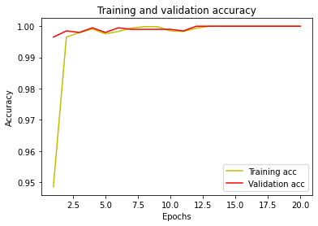
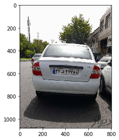
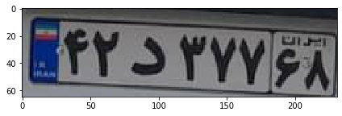
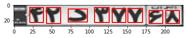

## iranian car plate detection using YOLO V8

This project has three parts :

*1- Find the coordinates of the license plate* > 

*2- Perform some image processing techniques to improve the image*

*3- Recognition of the characters on the license plate*

#
The first part was done using transfer learning with the help of pre-trained Yolo model on the following two datasets:

1: [IranianCarsNumberPlate](https://www.kaggle.com/datasets/skhalili/iraniancarnumberplate)

2: [Iran-Vehicle-plate-dataset](https://www.kaggle.com/datasets/samyarr/iranvehicleplatedataset?select=Vehicle+Plates)

These datasets were converted into a suitable YOLO format and the inappropriate ones were removed, and the method used in data augmentation is as follows. It was used for generalization, and finally the total number of images reached 2672 and was divided into three parts: train, valid and test.
The code is available in:
>`detect-iranian-car-plate.ipynb`

#
`Flip: Horizontal`
#
`Crop: 0% Minimum Zoom, 20% Maximum Zoom`
#
`Rotation: Between -22° and +22°`
#
`Shear: ±26° Horizontal, ±28° Vertical`
#
`Hue: Between -25° and +25°`
#
`Saturation: Between -75% and +75%`
#
`Brightness: Between -39% and +39%`
#
`Exposure: Between -29% and +29%`
#
`Blur: Up to 1px`
#
`Noise: Up to 5% of pixels`
#
`Cutout: 3 boxes with 10% size each`
#
`Bounding Box: Rotation: Between -7° and +7°`
#
`Bounding Box: Shear: ±15° Horizontal, ±15° Vertical`
#
`Bounding Box: Brightness: Between -25% and +25%`
#
`Bounding Box: Exposure: Between -25% and +25%`
#
`Bounding Box: Blur: Up to 0.75px`
#
`Bounding Box: Noise: Up to 5% of pixels`
#

This model was trained in 120 epochs، its details can be seen in the
>*results.png*

In the next step, this image should be straightened and its extra parts should be removed and its characters should be extracted with the help of edge detection algorithms.The image of each character must change to 28*28،then the extracted characters one by one should be predicted by the model we have trained for this task، this model is described below.
You can see the main project code tested on a test image and get 100 % accuracy in the file below

>`main.ipynb`

The following dataset was used for the character recognition model:

[Large dataset of Persian license plate characters](https://www.kaggle.com/datasets/amirebrahimi66/large-dataset-of-persian-license-plate-characters)

which includes the following 24 classes:
>['1','2', '3', '4','5','6','7','8','9','A','B','C','D','E','G','H','J','L','M','N','S','T','V','Y']

The summary of the model is as follows:

---
This model was trained in 20 epochs
You can see accuracy and loss charts in these photos 
>*loss.png* 

>*accuracy.png*

> 
> test image showed bellow
>
> 
> 
> The output of the Yolo model is also shown in the image below
> 
> 

The output of the image processing techniques is also shown in the image below

